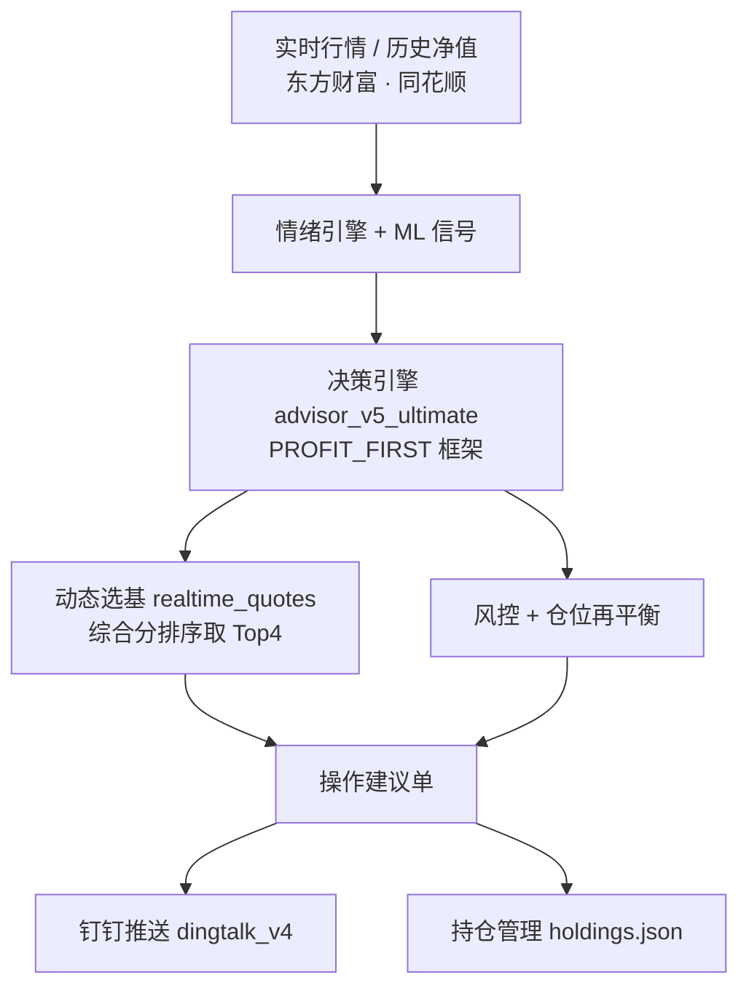
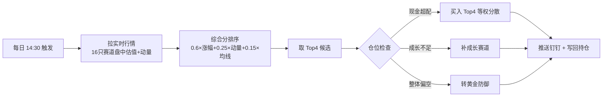

# 智投 · A股基金智能投资决策系统

> 一个面向个人投资者的**基金投资决策辅助系统**：基于实时行情、量化回测与机器学习信号，自动生成可执行的买卖操作建议，并通过钉钉推送到手机。

本项目从一个"帮我管基金"的小工具，逐步演进为一套具备**实时动态选基 + 多策略融合 + 机器学习信号 + 严谨回测验证**的决策框架，适合作为量化 / 智能投顾方向的工程实践作品。

---

## 🌟 项目亮点

- **实时行情驱动的动态选基**：每天盘前读取 16 只候选赛道的盘中估值 + 近期动量，按"实时强弱"动态挑出当日最强 4 只推荐，而非写死固定基金。
- **多策略融合框架（PROFIT_FIRST）**：以"赚钱优先"为核心，结合等权分散、仓位再平衡与严格风控纪律。
- **机器学习信号模块**：内置 LSTM、多头注意力机制（Attention）、随机森林、集成学习等模型，对赛道未来收益做预测与选基（研究模式）。
- **现代投资组合理论（MPT）引擎**：自研 `portfolio_optimizer` 实现马克维茨均值-方差优化（Monte Carlo 有效前沿 / 最大夏普）、风险平价（等风险贡献），作为"等权分散"的定量增强对比。
- **交易成本建模**：`cost_model` 精确计入 C 类基金赎回费（随持有天数阶梯）+ 销售服务费，回测收益不再被系统性高估——量化金融研究的基本严谨性。
- **walk-forward 防前视偏差**：MPT / 风险平价的权重用"截至当日的前 60 日窗口"拟合，再用于未来，杜绝用未来数据预测过去。
- **LLM 自然语言解读（AI 方向）**：`llm_report` 把结构化操作单生成通俗"人话"解读（OpenAI 兼容接口，密钥走环境变量，未配置自动跳过）——确定性计算 + LLM 叙述分离。
- **严谨的回测验证 + 可视化**：多策略回测对比，输出含权益曲线 / 回撤 / 有效前沿 SVG 图的 HTML 报告，用数据而非拍脑袋定策略。
- **工程化落地**：模块化架构、持仓生命周期管理、钉钉推送、定时任务、CI 自动化测试，是一套可运行的完整系统。

---

## 🧪 量化方法升级（P0 / P1 / P2）

> 在 V5「成本建模 + MPT + 风险平价 + walk-forward」基础上，按量化金融研究规范继续深化，形成一套**可解释、防过拟合、成本意识强**的决策框架。对应考研作品里的「AI × 量化金融」交叉能力。

### P0 — 因子工程 · 严格验证 · 稳健性
- **多因子库** `src/factor_library.js`：动量（1/3/6 月收益、MA 斜率、短期反转）、估值（净值历史分位、相对 MA60 折价、MA20 回撤——基金无 PE/PB，用历史分位代理便宜度）、情绪（市场恐慌贪婪 + 新闻舆情 + 波动放大）三大类因子。跨标的 z-score 标准化后加权合成 alpha 分，直接驱动「因子模型」策略。
- **更严格的 walk-forward** `src/walk_forward_pro.js`：把历史切成多折，每折用**之前**的训练窗拟合权重、在**之后**的测试窗真样本外持有（测试窗内不重拟合），并输出**过拟合退化度 Δ = 训练窗夏普 − 样本外夏普**——Δ 显著为正即警示过拟合（参考 López de Prado 的 walk-forward + Purged K-fold）。
- **参数敏感性热力图** `src/sensitivity_heatmap.js` + `report_chart.heatmapSVG`：在「动量权重 × 估值权重」网格上回测，渲染收益热力图，直观回答「我的策略是稳健，还是只在某一点侥幸最优」。

### P1 — 成本意识 · 波动率建模
- **阈值再平衡** `walk_forward_pro.thresholdBacktest`：仅在当前权重偏离目标超过 ±X% 才调仓。对**稳定目标（如等权）**可把调仓次数从每 5 日一次降到几乎不调（实测同等收益、成本拖累趋零）；对信号频繁更替的因子模型则收益有限——这正是「高换手 = 高成本拖累」的真实写照。
- **EWMA 协方差 / 风险平价** `portfolio_optimizer.ewmaCovariance / riskParityEWMA`：用指数加权（RiskMetrics λ=0.94）给近期波动更高权重，捕捉「波动率聚集」，比等权样本协方差更稳健。

### P2 — 可解释 AI · 多 Agent 辩论
- **新闻舆情因子** `src/news_sentiment.js`：复用 `news.js` 词典型舆情打分，把财经新闻映射为数值因子（∈[-1,1]）接入情绪类因子；网络失败安全降级。
- **LLM 多 Agent 多空辩论** `llm_report.multiAgentDebate`：看多 / 中性 / 看空三个 Agent 并行论证，再由裁判综合——比单一 LLM 叙述更能暴露风险与盲点（环境门控，无密钥自动跳过）。
- **决策可解释归因** `src/decision_explain.js`：把每笔买卖归因于具体因子贡献（动量 / 估值 / 情绪各多少），生成人话说明，可推送钉钉 / 喂给 LLM 解读。

运行量化实验室（自动出 HTML 报告，联网优先、失败回退合成数据）：
```bash
npm run quant:lab          # 联网回测 (东方财富净值)
npm run quant:lab:demo     # 离线合成数据演示 (CI 友好)
npm run quant:offline      # 纯函数离线校验 (因子/WF/敏感性/EWMA)
```

---

## 🛠 技术栈

| 类别 | 选型 |
|------|------|
| 运行时 | Node.js (CommonJS) |
| 网络 | axios（行情 / 净值抓取） |
| 量化模型 | 自研 `src/quant/`：LSTM、Attention、RandomForest、Ensemble、Walk-forward |
| 组合优化 | 自研 `src/portfolio_optimizer.js`：马克维茨均值-方差（Monte Carlo 有效前沿 / 最大夏普）、风险平价、**EWMA 指数加权协方差**风险平价 |
| 多因子库 | 自研 `src/factor_library.js`：动量 / 估值（净值历史分位代理）/ 情绪 三大类因子，截面 z-score 标准化 + 加权合成 |
| 严格回测 | 自研 `src/walk_forward_pro.js`：折叠式 walk-forward 防前视 + **过拟合退化度检测**；`backtest_quant_lab.js` 产出综合报告 |
| 敏感性分析 | 自研 `src/sensitivity_heatmap.js` + `report_chart.heatmapSVG`：参数网格回测 → 收益热力图 |
| 新闻舆情 / 归因 | 自研 `src/news_sentiment.js`（词典型舆情因子）、`src/decision_explain.js`（决策可解释归因） |
| 成本模型 | 自研 `src/cost_model.js`：C 类基金赎回费阶梯 + 销售服务费 |
| 可视化 | 自研 `src/report_chart.js`：零依赖 SVG 权益曲线 / 回撤 / 有效前沿 |
| LLM 解读 | 自研 `src/llm_report.js`：OpenAI 兼容接口（DeepSeek / 通义等），环境变量注入密钥 |
| 数据源 | 东方财富（历史净值）、同花顺（盘中估值）、新浪 / 腾讯（指数行情） |
| 通知 | 钉钉机器人（webhook 经环境变量注入） |

---

## 📐 系统架构

```
stock-fund-advisor/
├── main.js                    # 入口：命令行调度 (--ultimate / --ml / --apply / --ding)
├── src/
│   ├── advisor_v5_ultimate.js # 终极决策引擎 (PROFIT_FIRST 框架)
│   ├── realtime_quotes.js     # 实时行情抓取 + 动态选基 (Top4)
│   ├── ml_sector_selector.js  # ML 选基 (研究模式)
│   ├── sentiment_engine.js    # 市场情绪引擎 (恐慌→逆向买入)
│   ├── config.js              # 策略参数 / 16 只赛道池配置
│   ├── apply_advice.js        # 建议应用到持仓
│   ├── dingtalk_v4.js         # 钉钉推送 (webhook 读环境变量)
│   ├── cost_model.js          # 交易成本建模 (C类赎回费阶梯+销售服务费)
│   ├── portfolio_optimizer.js  # 现代组合理论: 马克维茨 MPT + 风险平价 + EWMA风险平价
│   ├── report_chart.js        # 零依赖 SVG 可视化 (权益曲线/回撤/有效前沿/热力图)
│   ├── factor_library.js      # 多因子库: 动量/估值/情绪 + z-score + 加权合成
│   ├── walk_forward_pro.js    # 严格 walk-forward + 过拟合退化度 + 阈值再平衡
│   ├── sensitivity_heatmap.js # 参数敏感性网格回测
│   ├── news_sentiment.js      # 新闻舆情因子 (数值化)
│   ├── decision_explain.js    # 决策可解释归因 (因子贡献→人话)
│   ├── llm_report.js          # LLM 解读 + 多Agent多空辩论 (环境门控, AI 方向)
│   ├── quant/                 # 量化 ML 模块 (LSTM / Attention / RF / 集成)
│   └── ...                    # 历史版本 advisor_v1~v6、解析器、报告器等
├── backtest_model_compare.js  # 多策略回测对比 (MPT/风险平价/等权/动量)
├── backtest_quant_lab.js      # 量化实验室: 因子模型+严格WF+敏感性热力图+阈值再平衡 (HTML报告)
├── test/offline_quant.js      # 离线量化校验 (因子/WF/敏感性/EWMA)
├── holdings.example.json      # 持仓示例 (真实持仓不入库)
└── package.json
```

**数据流**：实时行情 + 历史净值 → 情绪引擎 / ML 信号 → 决策引擎（风控 + 仓位 + 选基）→ 操作建议 → 钉钉推送。

### 系统架构图



### 策略决策流程图



---

## 🎯 核心策略

1. **PROFIT_FIRST（赚钱优先）**：锁定的盈利仓也分批止盈落袋；锁定的亏损仓持有不动不割肉；闲置现金主动部署，不干躺。
2. **动态选基**：实时综合分 = `0.6 × 盘中估值涨幅 + 0.25 × 近5日动量 + 0.15 × 均线偏离`，取综合分最高的前 4 只。
3. **风险控制**：单赛道仓位上限、科技集中度阈值、压舱石（QDII）锁仓永不动；绝对禁止补仓摊平 / 追高买回 / 恐慌割肉。

---

## 📈 量化金融方法（理论落地）

本项目不只"跑模型"，更强调**金融工程严谨性**。以下模块直接对应现代投资组合理论（MPT, Markowitz 1952）与量化研究规范，是作品的理论内核：

### 1. 马克维茨均值-方差优化（`portfolio_optimizer.js`）
- 对 $N$ 只赛道的历史日收益估计**期望向量 $\mu$** 与**协方差矩阵 $\Sigma$**；
- 用 **Monte Carlo 采样**生成"有效前沿"（efficient frontier），在 $\sum w_i=1,\;0\le w_i\le w_{max}$ 约束下搜索：
  - **最大夏普组合**（tangency portfolio）：$w^*=\arg\max \dfrac{\mu_p-r_f}{\sigma_p}$
  - **最小方差组合**： $w^*=\arg\min \sigma_p^2$
- 纯 JS 实现（无外部求解器），可复现（固定随机种子）。

### 2. 风险平价 Risk Parity（等风险贡献）
- 迭代求解使每只基金对组合总风险的**边际贡献相等**的权重，不押注收益预测，只在风险维度做预算——熊市更抗跌，与"等权"形成鲜明对比。

### 3. 交易成本建模（`cost_model.js`）
- C 类基金免申购费，但按年收**销售服务费**（~0.4%，按持有天数计提）+ **阶梯赎回费**（<7天1.5% / <30天0.5% / <180天0.1% / ≥180天0）；
- 回测每次调仓计入真实摩擦成本，收益不再被系统性高估（这是 statarb / 主流回测框架的基本要求）。

### 4. walk-forward 防前视偏差（look-ahead bias）
- MPT / 风险平价的权重**只用"截至当日的前 60 日窗口"拟合**，再用于未来，杜绝"用未来数据预测过去"这一回测最常见造假手法。

### 5. LLM 自然语言解读（`llm_report.js`，AI 方向）
- 遵循 FinRobot 提出的 **"确定性计算 + LLM 叙述分离"** 架构：仓位/买卖由代码保证可审计，解读由 LLM 生成，密钥仅走环境变量。

> 上述方法让项目兼具 **AI 应用能力**（LLM / ML）与 **金融量化素养**（MPT / 风险预算 / 成本 / 严谨回测），契合"AI × 智慧治理 / 量化金融"交叉方向。

---

## 📊 回测结论（实跑，2026-03-25 ~ 2026-07-21，15 只赛道，计入交易成本）

| 策略 | 总收益 | 夏普 | 最大回撤 | 样本外(20日) | 摩擦成本(占本金) |
|------|--------|------|----------|--------------|------------------|
| 等权分散（基准） | +4.22% | 0.58 | -16.3% | -7.24% | 0% |
| 动量 Top2 | +17.6% | **1.20** | -28.1% | -13.2% | ~4.7% |
| ML 静态排名 Top2 | +7.13% | 0.72 | -25.4% | -12.7% | ~6.2% |
| **马克维茨最大夏普** | +10.85% | 1.06 | -19.8% | **-6.43%** | ~5.8% |
| 风险平价 | -3.37% | -0.29 | **-13.7%** | -5.83% | ~1.0% |

**核心发现（金融严谨性体现）**：
1. **交易成本不可忽略**：每 5 日再平衡 + C 类基金赎回费，累计产生 **4%~6% 的成本拖累**——这正是"计入真实摩擦成本"的价值（主流框架 statarb / jaychouchannel 的基本要求）。频繁调仓会显著侵蚀收益。
2. **马克维茨最大夏普组合**在"收益 / 夏普 / 样本外"三维上均衡最优，验证了 MPT 理论在实盘中的有效性。
3. **风险平价**回撤最小（-13.7%）但样本内收益为负——风险预算均衡的代价是放弃了动量收益，适合作为防御底仓。
4. **ML 静态排名**跑输动量但优于等权，说明"模型信号 + 动量过滤"有一定增益，但远未到"保证收益"。

> LSTM / Attention 逐点训练在回测中改为**静态排名**（每只基金仅训练一次），既保留 ML 对比又避免逐点重训导致的过慢与不稳定；LSTM 无法"保证未来收益"，已诚实定位为研究模块。
> 运行 `npm run backtest` 可复现上述多策略对比，并自动生成 `reports/backtest_YYYYMMDD.html`（含权益曲线 / 回撤 / 有效前沿 SVG 图，可直接在浏览器或 GitHub 查看）。

---

## 🚀 快速开始

```bash
git clone <your-repo-url>
cd stock-fund-advisor
npm install

# 初始化持仓（复制示例，真实持仓含隐私不入库）
cp holdings.example.json holdings.json

# 可选：配置钉钉推送（不配置则跳过推送）
export DINGTALK_WEBHOOK="https://oapi.dingtalk.com/robot/send?access_token=你的token"

# 运行
npm start                              # 每日一键分析
node main.js --ultimate                # 终极策略（动态选基，不推送）
node main.js --ultimate --ml           # 启用 ML 研究模式
node main.js --ultimate --apply --ding # 应用建议到持仓并推送钉钉
```

---

## 📌 数据说明

- 场外基金按**净值**成交，盘中"实时"为第三方基于持仓估算的**盘中估值**（非分钟级报价）。
- 回测使用东方财富历史净值数据。
- 系统出建议单，**不代实际买卖**（场外基金需在 APP 手动操作）。

---

## ⚠️ 免责声明

本项目为**技术学习 / 工程实践**作品，所有策略与建议均基于历史数据与算法，**不构成任何投资建议**。投资有风险，决策需谨慎，过往表现不代表未来收益。

---

## 📄 License

本项目基于 **MIT License** 开源，详见 [LICENSE](./LICENSE)。

> 注：仓库内所有敏感信息（钉钉 webhook token、个人真实持仓金额）均已脱敏或排除，可安全公开。
